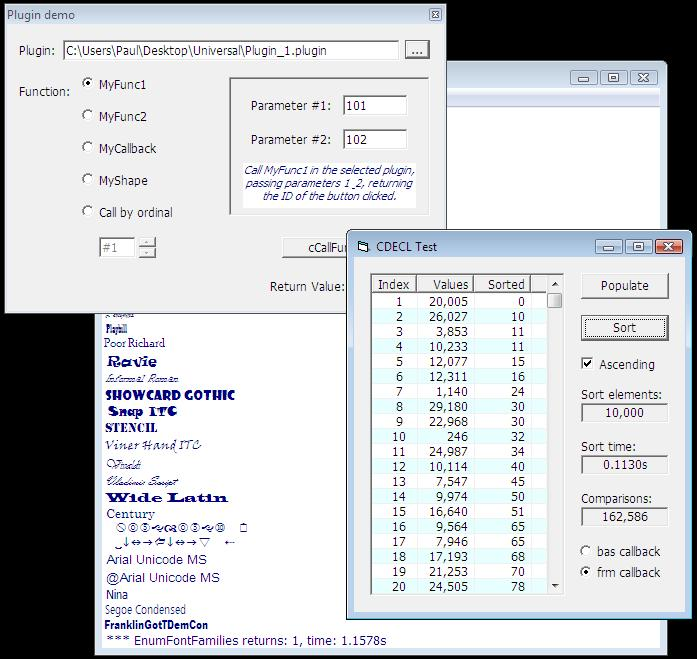



## Universal dll function caller, CDECL &amp; stdcall with \.bas/\.cls/\.frm/\.ctl callbacks

### Description

I received a report recently that my 2003 CDECL submission had generated DEP errors on Server 2003. I've updated that submission, but whilst doing so, I saw the potential for some improvements. Enhancements that really needed a new submission. Features: Transparent CDECL/stdcall function calling. Call functions by ordinal or name. Module (.bas) callbacks for CDECL functions. Object (.cls/.frm/.ctl) callbacks for CDECL and stdcall functions. Support for multiple callbacks. Support for multiple cCallFunc.cls instances. Support unicode path\module names. NEW SUBMISSION: 70195
 
### More Info
 

             |
---                |---
**Submitted On**   |2007-12-04 14:01:12
**By**             |[Paul Caton](https://github.com/Planet-Source-Code/PSCIndex/blob/master/ByAuthor/paul-caton.md)
**Level**          |Advanced
**User Rating**    |5.0 (104 globes from 21 users)
**Compatibility**  |VB 6\.0
**Category**       |[Miscellaneous](https://github.com/Planet-Source-Code/PSCIndex/blob/master/ByCategory/miscellaneous__1-1.md)
**World**          |[Visual Basic](https://github.com/Planet-Source-Code/PSCIndex/blob/master/ByWorld/visual-basic.md)
**Archive File**   |[Universal\_2092781242007\.zip](https://github.com/Planet-Source-Code/paul-caton-universal-dll-function-caller-cdecl-amp-stdcall-with-bas-cls-frm-ctl-callbacks__1-69718/archive/master.zip)

